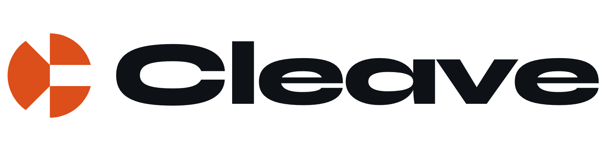

<p align="center">
  <picture>
    <source media="(prefers-color-scheme: dark)" srcset=".github/lockup-cream.png">
    
  </picture>
</p>

<p align="center">A programming language for building custom blockchains from scratch.</p>

<br />

Cleave treats the seams between subsystems as first-class language primitives. Consensus, gas, state, and the execution VM are declared in Cleave and composed like any other type. Most chain frameworks make the common case easy and the uncommon case impossible; Cleave is built to make the uncommon case the default.

> Status: v0.1.0. The compiler lexes and parses chain manifests. Codegen and runtime are not implemented yet.

## At a glance

```cleave
chain MyChain {
    consensus: Tendermint<sig=BLS12_381, finality=Deterministic>
    gas:       Multidim<{cpu, storage, witness}>
    state:     SparseMerkle<key=u256, hash=Blake3>
    exec:      WasmVM<deterministic>
}
```

Every line above is a protocol that ships with the standard library. Replace any one of them with your own implementation by satisfying the same interface. Your chain is the composition; the language is the composition rules.

More syntax in [`examples/`](examples/): chain manifests, contract modules, and a worked custom-consensus protocol. The full architecture story lives in [`DESIGN.md`](DESIGN.md). The formal grammar and glossary are in [`spec/`](spec/).

## Why

The dominant chain frameworks (Substrate, Cosmos SDK, Sovereign SDK) reach for the same shape: write a state-transition function in a general-purpose language, plug into a fixed consensus, accept a fixed validator-set abstraction. The moment a project needs a consensus mechanism, slashing rule, or block-contents shape that the framework did not anticipate, the path is to fork the framework. Forks accumulate. Drift accumulates. Each chain ends up its own dialect.

Cleave reframes the problem. The language's primitives are the protocols between subsystems, not the implementations of them. A new consensus design becomes a module satisfying the consensus protocol, not a fork of the framework. The escape hatch is the front door.

## What's coming

- v0.1: Bootstrap compiler in C. WASM execution target only.
- v0.2: Chain manifest grammar. Worked example.
- v0.3: EVM execution module via embedded REVM.
- v0.4: Self-hosting compiler.

No dates. The roadmap moves at the speed it moves.

## License

Apache-2.0.

## Links

[cleavelang.org](https://cleavelang.org) · [@cleaveorg](https://x.com/cleaveorg)
